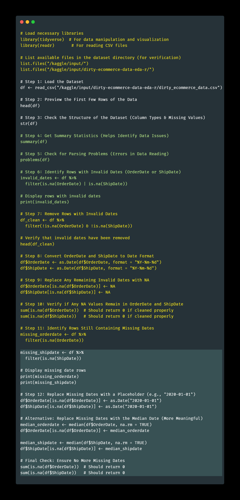

# E-commerce-EDA-Data-Analytics-with-the-tools-R 

## 1. Introduction 

In this project, we will perform data cleaning and exploratory data analysis (EDA) on a dirty e-commerce dataset. The dataset simulates real-world business data, containing errors, missing values, duplicates, and inconsistencies that are common in raw data collected from various sources.

The goal of this project is to apply data wrangling techniques using R to transform the messy dataset into a structured and analyzable format. This will involve:

Handling missing values and duplicates Correcting invalid or inconsistent data entries Converting data types appropriately Identifying outliers and anomalies Performing exploratory data analysis to extract insights By the end of this project, we will have a clean dataset ready for further business analysis and visualization. 

## 2. Data Overview 

This dataset contains 9,000+ rows and 20+ columns, providing detailed information on customer transactions, including order details, customer demographics, sales data, and shipping information. Below is a description of each feature:

📂 Feature Description
Column Name	Description
Order ID	Unique identifier for each order.
Order Date	Date when the order was placed.
Ship Date	Date when the order was shipped.
Ship Mode	Shipping method used for delivery.
Customer ID	Unique identifier for each customer.
Customer Name	Full name of the customer.
Segment	Customer segment (e.g., Consumer, Corporate, Home Office).
Country	Country where the order was placed.
City	City of the customer.
State	State or province of the customer.
Postal Code	Postal code of the customer’s location.
Region	Geographic region (e.g., West, East, South, Central).
Product ID	Unique identifier for each product.
Category	Main product category (e.g., Furniture, Office Supplies, Technology).
Sub-Category	Subcategory of the product.
Product Name	Name of the product.
Sales	Total sales amount for the order.
Quantity	Number of items ordered.
Discount	Discount applied to the order.
Profit	Profit earned from the order.

[Download the dataset](https://github.com/gerardnynkeu/Portfolio-Data-Analytics/blob/main/E-commerce-EDA-R/dirty_ecommerce_data..csv) 

📌 Key Insights

    The dataset allows for sales performance analysis, including profitability and discount impact.
    It helps identify regional sales trends and customer behavior.
    Useful for predictive modeling to optimize marketing and logistics strategies.

This structured dataset provides valuable insights for business decision-making and data-driven analysis. 🚀 

Key Characteristics of the Dataset¶
✔ Contains missing values, duplicates, and inconsistencies, making it ideal for data cleaning.
✔ Includes both categorical and numerical data, useful for exploratory data analysis.
✔ Ideal for data visualization and business insights such as customer segmentation, sales trends, and profitability analysis. 

## 3. Loading the Dataset and Cleaning the rows

Before analyzing the dataset, I first loaded it into R, checked for missing values, and handled invalid dates. Below is the step-by-step process with explanations. 

 

# 📌 Step 4: Exploratory Data Analysis (EDA)

Before building a model, I performed Exploratory Data Analysis (EDA) to understand the dataset’s structure, identify issues, and prepare it for further analysis. This step includes:

    🔍 4.1 Checking Missing Values – Identifying and handling missing data to ensure data integrity. 
Before proceeding with data analysis, I checked and handled missing values to ensure the dataset's completeness and reliability. Here’s how I approached it:
🔍 Step 1: Checking for Missing Values

 

    📑 4.2 Detecting Duplicates – Checking for duplicate entries that may skew analysis.
    🔢 4.3 Handling Data Types – Ensuring each column has the correct data type for accurate computations.
    📊 4.4 Identifying Outliers – Detecting extreme values that might impact model performance.
    📈 4.5 Feature Distribution – Analyzing how different features are distributed to understand patterns in the data.

This step provides a clear understanding of the dataset, ensuring a solid foundation for analysis and modeling. 🚀

