# E-commerce-EDA-Data-Analytics-with-the-tools-R 

## 1. Introduction 

In this project, we will perform data cleaning and exploratory data analysis (EDA) on a dirty e-commerce dataset. The dataset simulates real-world business data, containing errors, missing values, duplicates, and inconsistencies that are common in raw data collected from various sources.

The goal of this project is to apply data wrangling techniques using R to transform the messy dataset into a structured and analyzable format. This will involve:

Handling missing values and duplicates Correcting invalid or inconsistent data entries Converting data types appropriately Identifying outliers and anomalies Performing exploratory data analysis to extract insights By the end of this project, we will have a clean dataset ready for further business analysis and visualization. 

## 2. Data Overview 

This dataset contains 9,000+ rows and 20+ columns, providing detailed information on customer transactions, including order details, customer demographics, sales data, and shipping information. Below is a description of each feature:

📂 Feature Description
Column Name	Description
Order ID	Unique identifier for each order.
Order Date	Date when the order was placed.
Ship Date	Date when the order was shipped.
Ship Mode	Shipping method used for delivery.
Customer ID	Unique identifier for each customer.
Customer Name	Full name of the customer.
Segment	Customer segment (e.g., Consumer, Corporate, Home Office).
Country	Country where the order was placed.
City	City of the customer.
State	State or province of the customer.
Postal Code	Postal code of the customer’s location.
Region	Geographic region (e.g., West, East, South, Central).
Product ID	Unique identifier for each product.
Category	Main product category (e.g., Furniture, Office Supplies, Technology).
Sub-Category	Subcategory of the product.
Product Name	Name of the product.
Sales	Total sales amount for the order.
Quantity	Number of items ordered.
Discount	Discount applied to the order.
Profit	Profit earned from the order.

[Download the dataset](https://github.com/gerardnynkeu/Portfolio-Data-Analytics/blob/main/E-commerce-EDA-R/dirty_ecommerce_data..csv) 

📌 Key Insights

    The dataset allows for sales performance analysis, including profitability and discount impact.
    It helps identify regional sales trends and customer behavior.
    Useful for predictive modeling to optimize marketing and logistics strategies.

This structured dataset provides valuable insights for business decision-making and data-driven analysis. 🚀 

Key Characteristics of the Dataset¶
✔ Contains missing values, duplicates, and inconsistencies, making it ideal for data cleaning.
✔ Includes both categorical and numerical data, useful for exploratory data analysis.
✔ Ideal for data visualization and business insights such as customer segmentation, sales trends, and profitability analysis. 

## 3. Loading the Dataset and Cleaning the rows

Before analyzing the dataset, I first loaded it into R, checked for missing values, and handled invalid dates. Below is the step-by-step process with explanations. 

 

# 📌 Step 4: Exploratory Data Analysis (EDA)

Before building a model, I performed Exploratory Data Analysis (EDA) to understand the dataset’s structure, identify issues, and prepare it for further analysis. This step includes:

    🔍 4.1 Checking Missing Values – Identifying and handling missing data to ensure data integrity. 
Before proceeding with data analysis, I checked and handled missing values to ensure the dataset's completeness and reliability. Here’s how I approached it:
🔍 Step 1: Checking for Missing Values

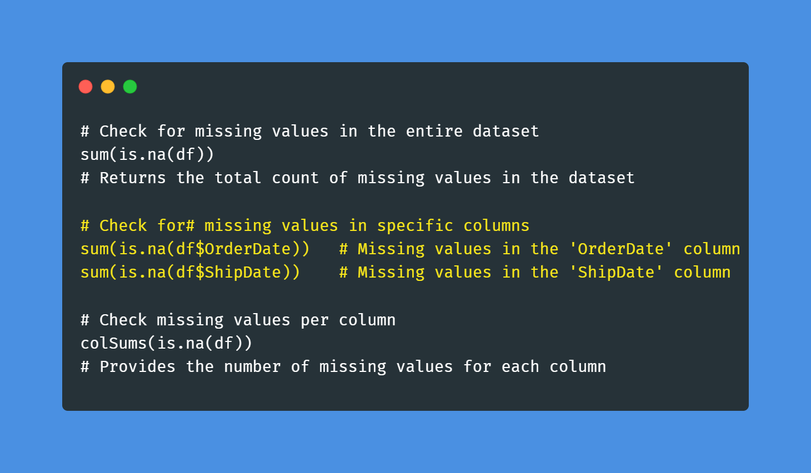 

👉 This helps identify which columns have missing values and how severe the issue is. 

Step 2: Visualizing Missing Data, Removing Rows with Critical Missing Values, Imputing Missing Values with Defaults, Imputing Missing Numeric Values 

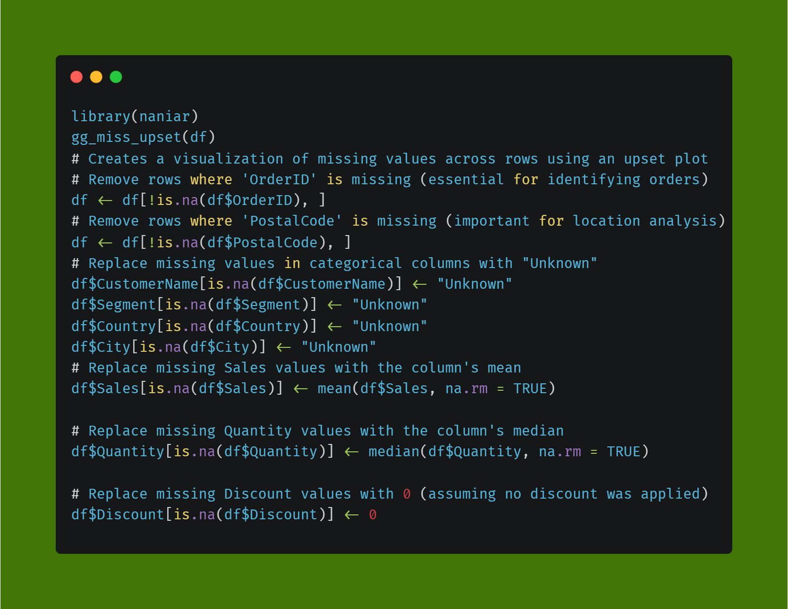 

Visualizing Missing Data 

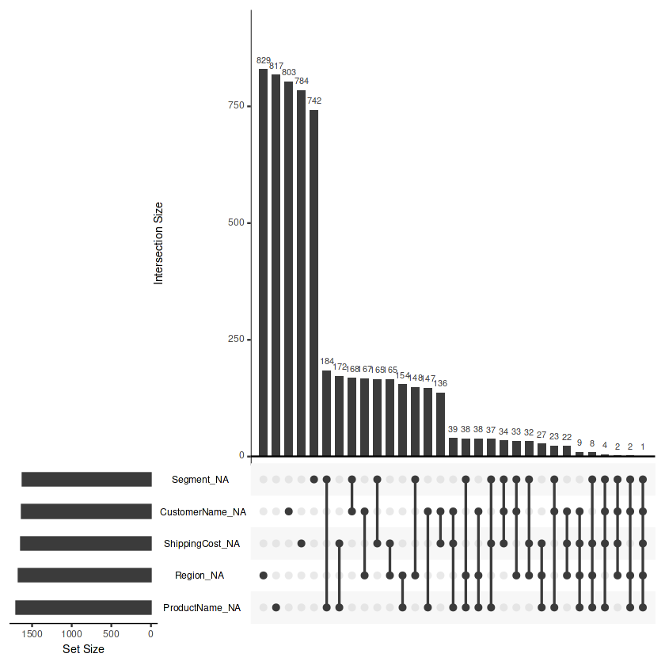 

    📑 4.2 Detecting Duplicates – Checking for duplicate entries that may skew analysis.
    🔢 4.3 Handling Data Types – Ensuring each column has the correct data type for accurate computations.
    📊 4.4 Identifying Outliers – Detecting extreme values that might impact model performance.
    📈 4.5 Feature Distribution – Analyzing how different features are distributed to understand patterns in the data. 

Here are the fonctions i used to solve Detecting Duplicates, Handling Data Types, Identifying Outliers, Feature Distribution 

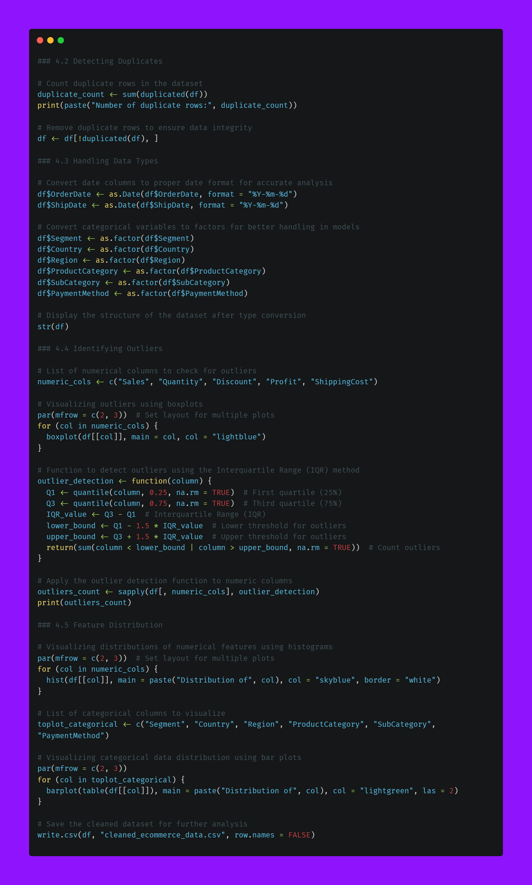  

The boxplots below represent the distribution of numerical variables in the dataset, helping to detect outliers.

    Sales: The distribution appears fairly symmetric with no significant outliers.
    Quantity: Similar to Sales, the data is well distributed without extreme values.
    Discount: There are outliers, indicating a few transactions with unusually high discounts.
    Profit: The data is mostly concentrated around lower values, but some high-profit transactions are visible.
    Shipping Cost: Shows significant outliers, meaning some transactions had exceptionally high shipping costs. 
The numbers on top of each category indicate the count of detected outliers, with Discount (1158) and Shipping Cost (1594) being the most affected.

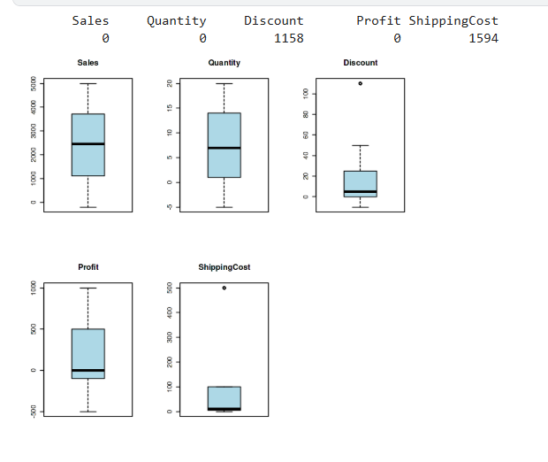  

The bar plots below display the distribution of categorical variables in the dataset:

    Segment: The different customer segments are relatively evenly distributed.
    Country: Spain has the highest number of transactions, while other countries show a more balanced distribution.
    Region: The transaction count across regions is quite similar, indicating no strong regional imbalance.
    Product Category: All categories have nearly equal representation.
    SubCategory: The subcategories also appear evenly distributed.
    Payment Method: Different payment methods are used fairly equally, with no dominant preference.

Overall, the dataset appears well-distributed across categories, ensuring balanced representation for analysis.

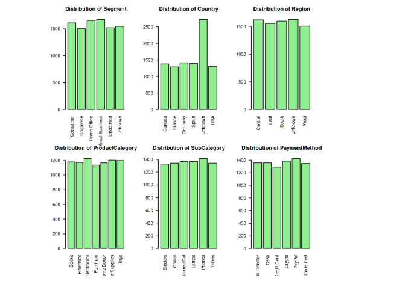  

This step provides a clear understanding of the dataset, ensuring a solid foundation for analysis and modeling. 🚀

## 5. Data Cleaning  

Data cleaning is a crucial step in preparing the dataset for analysis. This process ensures that the data is accurate, consistent, and free from errors that could affect the results. Below are the key steps involved:  
Identify and address missing data by either imputing values, replacing them with meaningful defaults, or removing incomplete records.  
Detect and correct inconsistencies in categorical values, such as misspellings or different formats of the same data entry. 
Identify and eliminate duplicate records to avoid data redundancy and ensure accuracy in analysis.  
Convert columns to their appropriate data types, such as transforming date fields into date format and categorical values into factors.  
Detect and manage extreme values that could skew analysis using methods like the interquartile range (IQR) or z-score filtering.  

- **5.1 Handling Missing Values**  
- **5.2 Fixing Data Inconsistencies**  
- **5.3 Removing Duplicates**  
- **5.4 Correcting Data Types**  
- **5.5 Handling Outliers**

Here are all the codes I used to tackle this step 

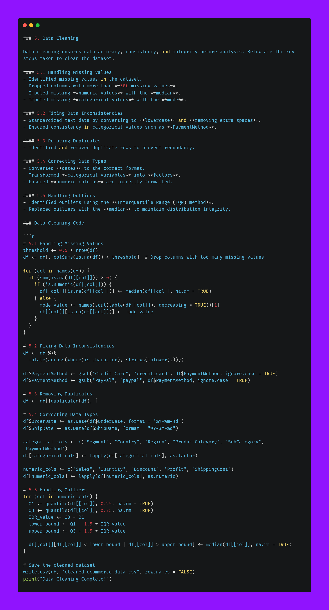  

# 6. Final Cleaned Data Overview 

After completing the data cleaning process, i conduct a final check to ensure data integrity and readiness for analysis. The following steps help us verify the structure, completeness, and uniqueness of the cleaned dataset.

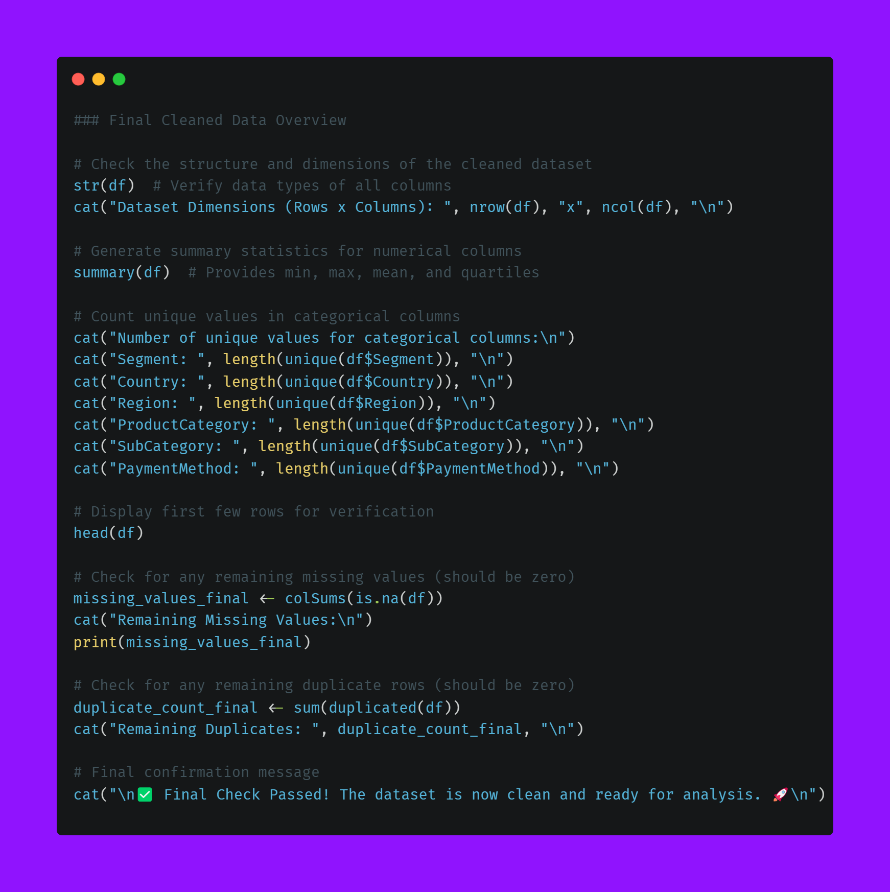 

## 7. Data Visualization & Insights.

Effective data visualization helps transform raw data into meaningful insights. By analyzing sales trends, customer behavior, and product performance, we can uncover patterns that drive business decisions. This section explores key visualizations to better understand sales performance, regional differences, and the impact of discounts on profitability.  

- **7.1 Sales Trends Over Time** 📈  
Analyzing sales trends over time helps identify patterns, seasonality, and potential growth opportunities. By visualizing sales data across different time periods (daily, monthly, yearly), we can uncover fluctuations in revenue, peak sales periods, and trends that impact business performance. This insight is crucial for making data-driven decisions on inventory, marketing strategies, and sales forecasting.

| Image 1 | Image 2 |
|---------|---------|
| 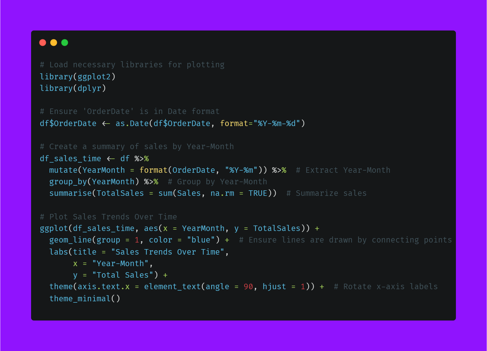 | 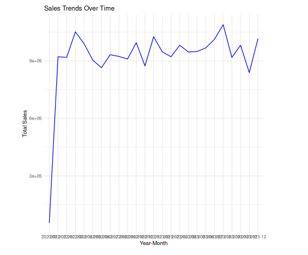

- **7.2 Customer Segmentation** 🎯
Customer segmentation involves dividing customers into distinct groups based on shared characteristics such as demographics, purchasing behavior, or order history. This step helps in understanding different customer types and tailoring marketing strategies accordingly.

In this project, i analyze customer segments based on variables like Segment, Region, and Purchase Patterns to identify high-value customers and optimize business decisions. Visualizations such as bar charts and clustering techniques can help uncover meaningful insights into customer behavior.

| Image 1 | Image 2|
|-------- |-------  
| 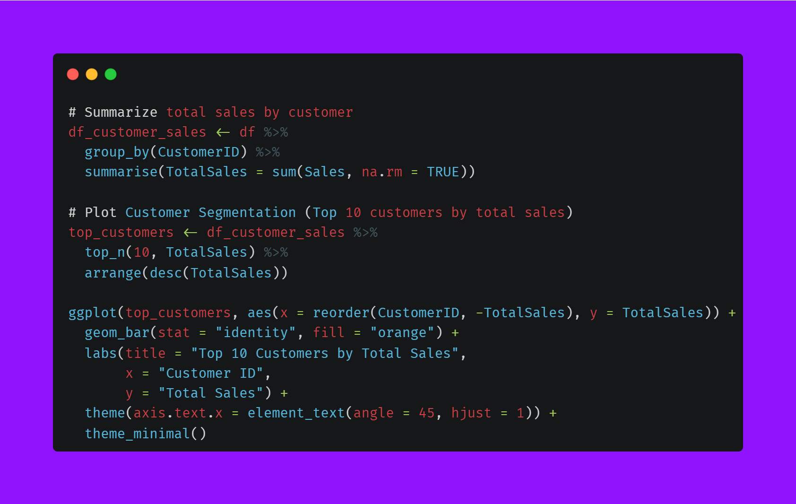 | 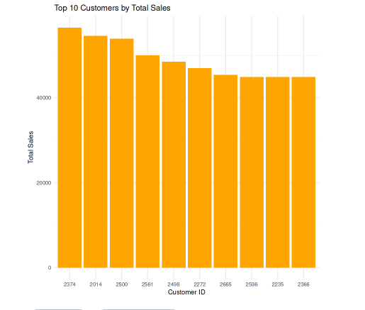

 

- **7.3 Top-Selling Products** 🏆  
  Identify the best-performing products based on sales volume and revenue.
  

| Image 1 | Image 2|
|-------- |-------  
| 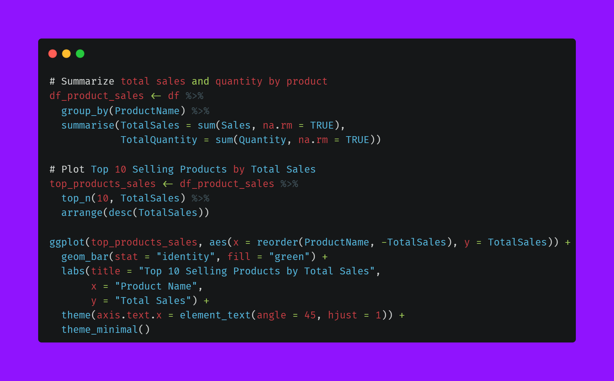 | 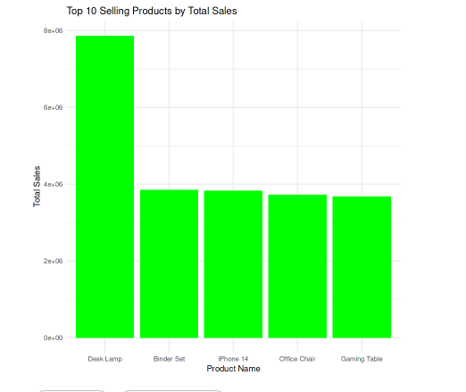 

- **7.4 Regional Sales Analysis** 🌍  
  Compare sales performance across different regions to spot high- and low-performing areas.

| Image 1 | Image 2|
|-------- |-------  
| 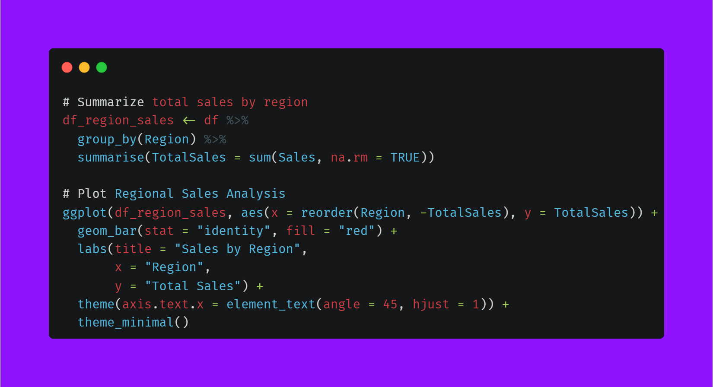 | 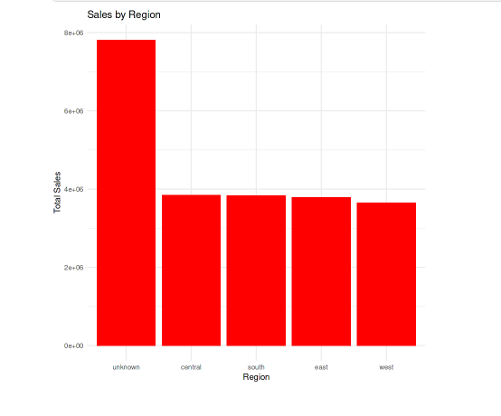
  

- **7.5 Discount vs. Profit Relationship** 💰  
  Analyze how discounts impact profitability and identify the optimal discounting strategy.

| Image 1 | Image 2|
|-------- |-------  
| 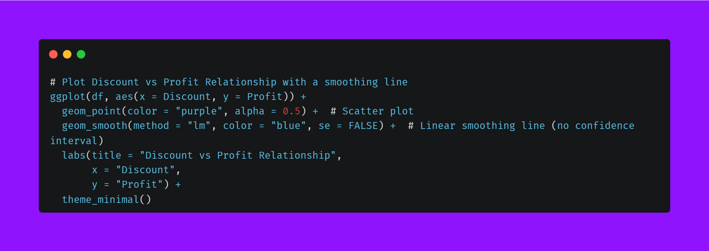 | 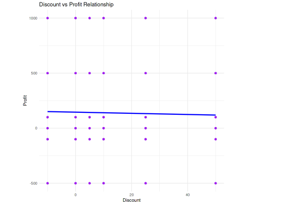

  

## 8. Tools & Technologies  

This project was developed and executed using the following tools:  

- **Programming Language:** R  
- **Platform:** Kaggle Notebooks  
- **Libraries Used:**  
  - `tidyverse` – Data manipulation and visualization  
  - `dplyr` – Data wrangling  
  - `ggplot2` – Data visualization  
  - `lubridate` – Date handling  
  - `stringr` – String manipulation  
  - `readr` – Reading and writing CSV files  

The project was run entirely on Kaggle, leveraging its cloud-based environment for data analysis and visualization.  

