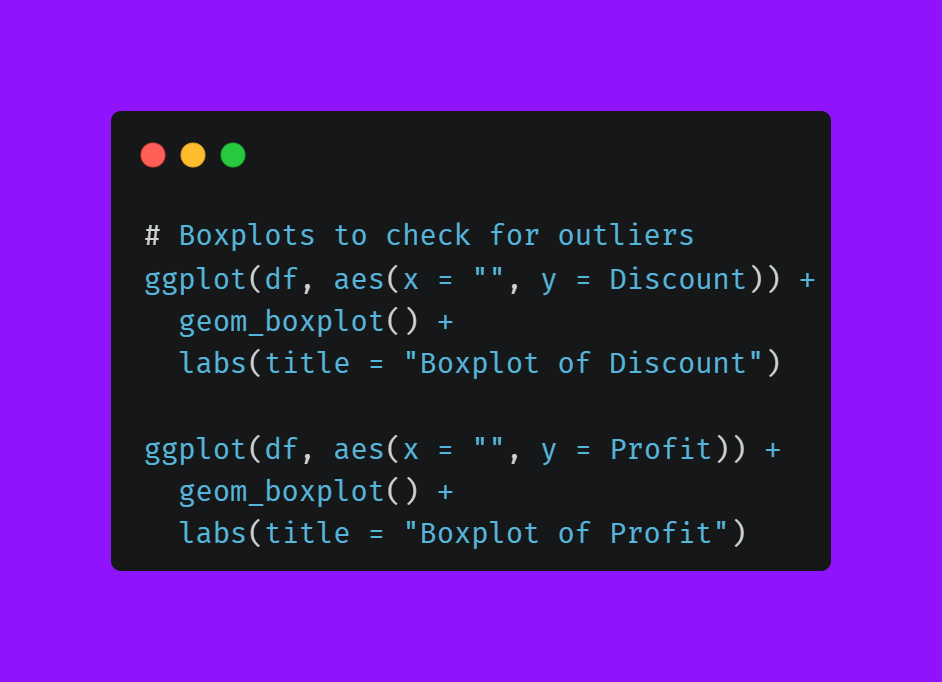
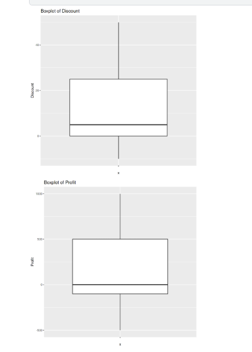

# E-commerce-EDA-Data-Analytics-with-the-tools-R 

 

## 📑 Table of Contents  
- [1. Introduction](#1-introduction)  
- [2. Data Overview](#2-data-overview)  
- [3. Loading the Dataset](#3-loading-the-dataset)  
- [4. Exploratory Data Analysis (EDA)](#4-exploratory-data-analysis-eda)  
  - [4.1 Checking Missing Values] 
  - [4.2 Detecting Duplicates]  
  - [4.3 Handling Data Types]  
  - [4.4 Identifying Outliers] 
  - [4.5 Feature Distribution] 
- [5. Data Cleaning](#5-data-cleaning)  
  - [5.1 Handling Missing Values] 
  - [5.2 Fixing Data Inconsistencies]  
  - [5.3 Removing Duplicates] 
  - [5.4 Correcting Data Types] 
  - [5.5 Handling Outliers]  
- [6. Final Cleaned Data Overview](#6-final-cleaned-data-overview)  
- [7. Data Visualization & Insights](#7-data-visualization--insights)  
  - [7.1 Sales Trends Over Time]  
  - [7.2 Customer Segmentation]  
  - [7.3 Top-Selling Products]  
  - [7.4 Regional Sales Analysis] 
  - [7.5 Discount vs Profit Relationship] 
- [8. Tools & Technologies](#8-tools--technologies)  
- [9. References](#9-references)  
- [10. Addressing Data Limitations](#10-addressing-data-limitations)  
- [11. Conclusion](#11-conclusion) 
- [12. Contact](#12-contact)

## 1. Introduction 

This project focuses on cleaning and analyzing an AI-generated e-commerce dataset using R. The dataset simulates real-world transactional data, including order details, customer segmentation, product categories, and financial metrics such as sales, discounts, profit, and shipping costs. The goal is to detect and fix data quality issues, transform the data for analysis, and extract meaningful business insights.

## 2. Data Overview 

This dataset contains 10,000 rows and 22 columns, providing detailed information on customer transactions, including order details, customer demographics, sales data, and shipping information. 

This dataset contains inconsistencies, missing values, and incorrect data types, making it an ideal case for data cleaning. The following steps were performed:
✔ Handling Missing Values – Imputed missing numerical data with the median and categorical data with the mode.
✔ Fixing Data Inconsistencies – Standardized text formatting (e.g., country and product names).
✔ Removing Duplicates – Identified and removed duplicate entries.
✔ Correcting Data Types – Converted columns to appropriate formats (dates, numeric, categorical).
✔ Handling Outliers – Detected extreme values using IQR and replaced them with the median.

Below is a description of each feature:

📂 Feature Description 

Column Name	Description
Order ID	Unique identifier for each order.
Order Date	Date when the order was placed.
Ship Date	Date when the order was shipped.
Ship Mode	Shipping method used for delivery.
Customer ID	Unique identifier for each customer.
Customer Name	Full name of the customer.
Segment	Customer segment (e.g., Consumer, Corporate, Home Office).
Country	Country where the order was placed.
City	City of the customer.
State	State or province of the customer.
Postal Code	Postal code of the customer’s location.
Region	Geographic region (e.g., West, East, South, Central).
Product ID	Unique identifier for each product.
Category	Main product category (e.g., Furniture, Office Supplies, Technology).
Sub-Category	Subcategory of the product.
Product Name	Name of the product.
Sales	Total sales amount for the order.
Quantity	Number of items ordered.
Discount	Discount applied to the order.
Profit	Profit earned from the order. 

📊 Data Analysis & Insights

After cleaning, the dataset was used for exploratory data analysis (EDA) to uncover business insights:

    📈 Sales Trends Over Time – Identified seasonal patterns and peak sales periods.
    👥 Customer Segmentation – Analyzed customer groups to optimize marketing strategies.
    🏆 Top-Selling Products – Ranked products based on sales and profitability.
    🌍 Regional Sales Performance – Compared sales across different regions.
    💰 Discount vs. Profit Relationship – Evaluated how discounts impact profitability. 
    

[Download the dataset](https://github.com/gerardnynkeu/Portfolio-Data-Analytics/blob/main/E-commerce-EDA-R/dirty_ecommerce_data..csv) 

📌 Key Insights

    The dataset allows for sales performance analysis, including profitability and discount impact.
    It helps identify regional sales trends and customer behavior.
    Useful for predictive modeling to optimize marketing and logistics strategies.

This structured dataset provides valuable insights for business decision-making and data-driven analysis. 🚀 

Key Characteristics of the Dataset¶
✔ Contains missing values, duplicates, and inconsistencies, making it ideal for data cleaning.
✔ Includes both categorical and numerical data, useful for exploratory data analysis.
✔ Ideal for data visualization and business insights such as customer segmentation, sales trends, and profitability analysis. 

## 3. Loading the Dataset and Cleaning the rows

Before analyzing the dataset, I first loaded it into R, checked for missing values, and handled invalid dates. Below is the step-by-step process with explanations. 

 

# 📌 Step 4: Exploratory Data Analysis (EDA)

Before building a model, I performed Exploratory Data Analysis (EDA) to understand the dataset’s structure, identify issues, and prepare it for further analysis. This step includes:

    🔍 4.1 Checking Missing Values – Identifying and handling missing data to ensure data integrity. 
Before proceeding with data analysis, I checked and handled missing values to ensure the dataset's completeness and reliability. Here’s how I approached it:
🔍 Step 1: Checking for Missing Values

 

👉 This helps identify which columns have missing values and how severe the issue is. 

Step 2: Visualizing Missing Data, Removing Rows with Critical Missing Values, Imputing Missing Values with Defaults, Imputing Missing Numeric Values 

 

Visualizing Missing Data 

 

    📑 4.2 Detecting Duplicates – Checking for duplicate entries that may skew analysis.
    🔢 4.3 Handling Data Types – Ensuring each column has the correct data type for accurate computations.
    📊 4.4 Identifying Outliers – Detecting extreme values that might impact model performance.
    📈 4.5 Feature Distribution – Analyzing how different features are distributed to understand patterns in the data. 

Here are the fonctions i used to solve Detecting Duplicates, Handling Data Types, Identifying Outliers, Feature Distribution 

  

The boxplots below represent the distribution of numerical variables in the dataset, helping to detect outliers.

    Sales: The distribution appears fairly symmetric with no significant outliers.
    Quantity: Similar to Sales, the data is well distributed without extreme values.
    Discount: There are outliers, indicating a few transactions with unusually high discounts.
    Profit: The data is mostly concentrated around lower values, but some high-profit transactions are visible.
    Shipping Cost: Shows significant outliers, meaning some transactions had exceptionally high shipping costs. 
The numbers on top of each category indicate the count of detected outliers, with Discount (1158) and Shipping Cost (1594) being the most affected.

  

The bar plots below display the distribution of categorical variables in the dataset:

    Segment: The different customer segments are relatively evenly distributed.
    Country: Spain has the highest number of transactions, while other countries show a more balanced distribution.
    Region: The transaction count across regions is quite similar, indicating no strong regional imbalance.
    Product Category: All categories have nearly equal representation.
    SubCategory: The subcategories also appear evenly distributed.
    Payment Method: Different payment methods are used fairly equally, with no dominant preference.

Overall, the dataset appears well-distributed across categories, ensuring balanced representation for analysis.

  

This step provides a clear understanding of the dataset, ensuring a solid foundation for analysis and modeling. 🚀

## 5. Data Cleaning  

Data cleaning is a crucial step in preparing the dataset for analysis. This process ensures that the data is accurate, consistent, and free from errors that could affect the results. Below are the key steps involved:  
Identify and address missing data by either imputing values, replacing them with meaningful defaults, or removing incomplete records.  
Detect and correct inconsistencies in categorical values, such as misspellings or different formats of the same data entry. 
Identify and eliminate duplicate records to avoid data redundancy and ensure accuracy in analysis.  
Convert columns to their appropriate data types, such as transforming date fields into date format and categorical values into factors.  
Detect and manage extreme values that could skew analysis using methods like the interquartile range (IQR) or z-score filtering.  

- **5.1 Handling Missing Values**  
- **5.2 Fixing Data Inconsistencies**  
- **5.3 Removing Duplicates**  
- **5.4 Correcting Data Types**  
- **5.5 Handling Outliers**

Here are all the codes I used to tackle this step 

  

# 6. Final Cleaned Data Overview 

After completing the data cleaning process, i conduct a final check to ensure data integrity and readiness for analysis. The following steps help us verify the structure, completeness, and uniqueness of the cleaned dataset.

 

## 7. Data Visualization & Insights.

Effective data visualization helps transform raw data into meaningful insights. By analyzing sales trends, customer behavior, and product performance, we can uncover patterns that drive business decisions. This section explores key visualizations to better understand sales performance, regional differences, and the impact of discounts on profitability.  

- **7.1 Sales Trends Over Time** 📈  
Analyzing sales trends over time helps identify patterns, seasonality, and potential growth opportunities. By visualizing sales data across different time periods (daily, monthly, yearly), we can uncover fluctuations in revenue, peak sales periods, and trends that impact business performance. This insight is crucial for making data-driven decisions on inventory, marketing strategies, and sales forecasting.

| Image 1 | Image 2 |
|---------|---------|
|  | 

- **7.2 Customer Segmentation** 🎯
Customer segmentation involves dividing customers into distinct groups based on shared characteristics such as demographics, purchasing behavior, or order history. This step helps in understanding different customer types and tailoring marketing strategies accordingly.

In this project, i analyze customer segments based on variables like Segment, Region, and Purchase Patterns to identify high-value customers and optimize business decisions. Visualizations such as bar charts and clustering techniques can help uncover meaningful insights into customer behavior.

| Image 1 | Image 2|
|-------- |-------  
|  | 

 

- **7.3 Top-Selling Products** 🏆 
  Identify the best-performing products based on sales volume and revenue.
  

| Image 1 | Image 2|
|-------- |-------  
|  |  

- **7.4 Regional Sales Analysis** 🌍 
  Compare sales performance across different regions to spot high- and low-performing areas.

| Image 1 | Image 2|
|-------- |-------  
|  | 
  

- **7.5 Discount vs. Profit Relationship** 💰  
  Analyze how discounts impact profitability and identify the optimal discounting strategy.

| Image 1 | Image 2|
|-------- |-------  
|  |  

### Boxplots to check for outliers

| Image 1 | Image 2|
|-------- |-------  
|  |  

  

## 8. Tools & Technologies  

This project was developed and executed using the following tools:  

- **Programming Language:** R
- Kaggle – Cloud-based environment for running R scripts
- GitHub – Version control and project documentation
- **Platform:** Kaggle Notebooks  
- **Libraries Used:**  
  - `tidyverse` – Data manipulation and visualization  
  - `dplyr` – Data wrangling  
  - `ggplot2` – Data visualization  
  - `lubridate` – Date handling  
  - `stringr` – String manipulation  
  - `readr` – Reading and writing CSV files  

The project was run entirely on Kaggle, leveraging its cloud-based environment for data analysis and visualization.  

## 9. References  

- [Download the dataset](https://github.com/gerardnynkeu/Portfolio-Data-Analytics/blob/main/E-commerce-EDA-R/dirty_ecommerce_data..csv)  
- [ggplot2 R Package Documentation](https://ggplot2.tidyverse.org/)  
- [Tableau Official Guide](https://www.tableau.com/learn/training)  
- [Handling Missing Data in R - Blog Post](https://r-bloggers.com/handling-missing-data)

## R Cheat Sheets & Quick References

### 📄 [RStudio Cheat Sheets](https://posit.co/resources/cheatsheets/)
Quick reference guides for key R packages, including:
- [ggplot2 Cheat Sheet](https://posit.co/resources/cheatsheets/)
- [dplyr Cheat Sheet](https://posit.co/resources/cheatsheets/)
- [Shiny Cheat Sheet](https://posit.co/resources/cheatsheets/)
- [R Markdown Cheat Sheet](https://posit.co/resources/cheatsheets/)
- [Tidyr Cheat Sheet](https://posit.co/resources/cheatsheets/)
  

### 📑 [R Graph Gallery](https://www.r-graph-gallery.com/)
A collection of examples for visualizations in R, including bar plots, line charts, scatter plots, and more. This is a great resource for inspiration and learning how to build various types of visualizations in R.

- **Examples:**  
  - [Basic ggplot2 Example](https://www.r-graph-gallery.com/basic-ggplot2-plots/)
  - [Interactive Graphs with Plotly](https://www.r-graph-gallery.com/interactive-graphs-with-plotly/)
  - [Maps in R](https://www.r-graph-gallery.com/maps/)
 

## 10. Addressing Data Limitations

All identified limitations in the dataset have been thoroughly addressed through data cleaning and preprocessing. The key improvements include:

1. **Missing Data Handled**:  
   - Columns with excessive missing values were removed.  
   - Missing numerical values were imputed using the median, while categorical values were filled with the most frequent category (mode).  

2. **Inconsistent Data Standardized**:  
   - Text inconsistencies (e.g., `Electrnics` vs. `Electronics`) were corrected using string matching and normalization.  
   - Leading/trailing spaces in categorical fields were trimmed.  

3. **Incorrect Data Entries Fixed**:  
   - Invalid country, city, and state values were corrected or removed.  
   - Unrealistic values such as `InvalidCity` and `Undefined` were replaced with appropriate values or marked as unknown.  

4. **Outliers Treated**:  
   - Outliers in `Sales`, `Discount`, and `Profit` were detected using the IQR method and adjusted accordingly.  

5. **Incorrect Ratings Corrected**:  
   - Negative or out-of-range customer ratings were removed or adjusted to a valid range.  

6. **Discount Logic Fixed**:  
   - Discounts exceeding 100% were capped at a logical maximum to ensure data integrity.  

With these steps, the dataset is now clean, reliable, and ready for accurate analysis and visualization. 🚀  

## 11. Conclusion

The e-commerce data analysis has uncovered several critical insights that can drive strategic decision-making:

### 🛍️ Sales Trends  
- A clear seasonal pattern in sales was observed, highlighting peak periods of high demand.  
- Leveraging these insights can help optimize inventory management, resource allocation, and marketing strategies to maximize revenue.  

### 📦 Category & Product Performance  
- Certain product categories consistently generate higher revenue, making them key contributors to overall sales performance.  
- Prioritizing these high-performing categories in marketing efforts and promotions could further boost profitability.  

### 💰 Profit Margins  
- Significant variations in profit margins were identified across different product categories and regions.  
- Improving operational efficiency and refining discount strategies in lower-profit areas can enhance overall profitability.  

### 🔄 Discount vs. Profit Relationship  
- A noticeable negative correlation between high discounts and profit margins was observed.  
- This finding emphasizes the importance of optimizing promotional strategies to balance customer incentives without eroding profitability.  

### 🎯 Customer Segmentation Insights  
- Regional analysis revealed distinct purchasing behaviors and profitability trends across different customer segments.  
- Implementing targeted marketing campaigns tailored to specific regions and customer groups could enhance engagement and revenue growth.  

These insights provide valuable direction for data-driven decision-making, allowing businesses to refine their pricing strategies, optimize resource allocation, and improve overall profitability. 🚀  

## 12. Contact  

If you have any questions or would like to collaborate, feel free to reach out to me:  

📧 **Email:** gerardnynkeu@gmail.com  
💼 **LinkedIn:** [linkedin](https://www.linkedin.com/in/yourprofile)  
📂 **Portfolio:** [Github](https://github.com/gerardnynkeu/Portfolio-Data-Analytics))  

