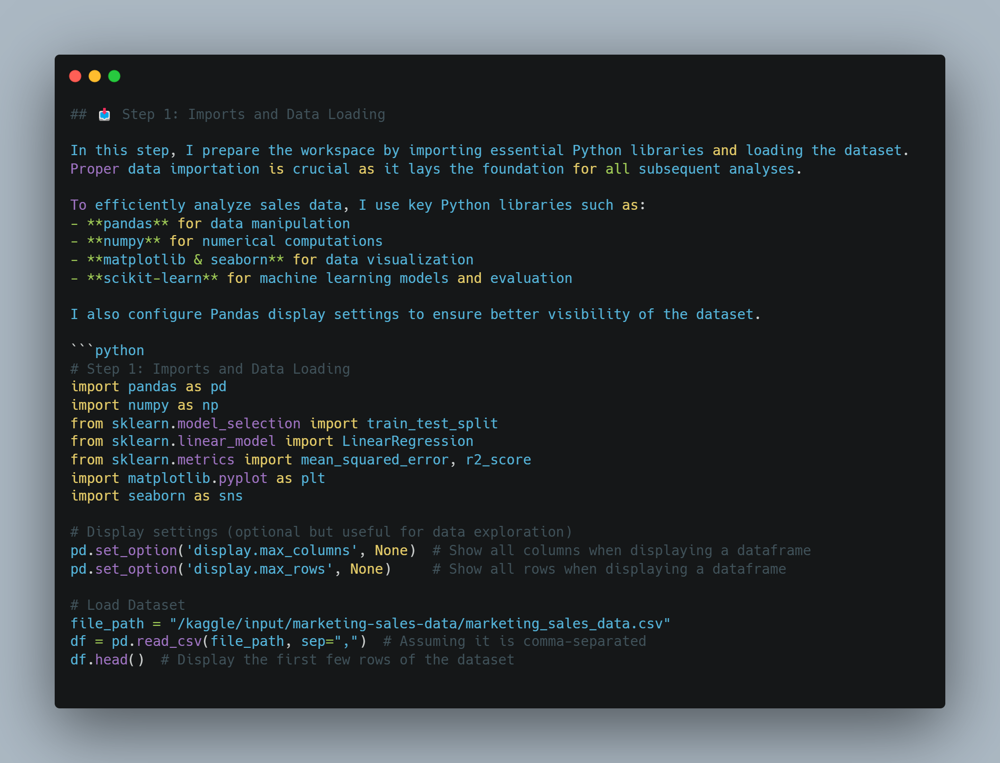
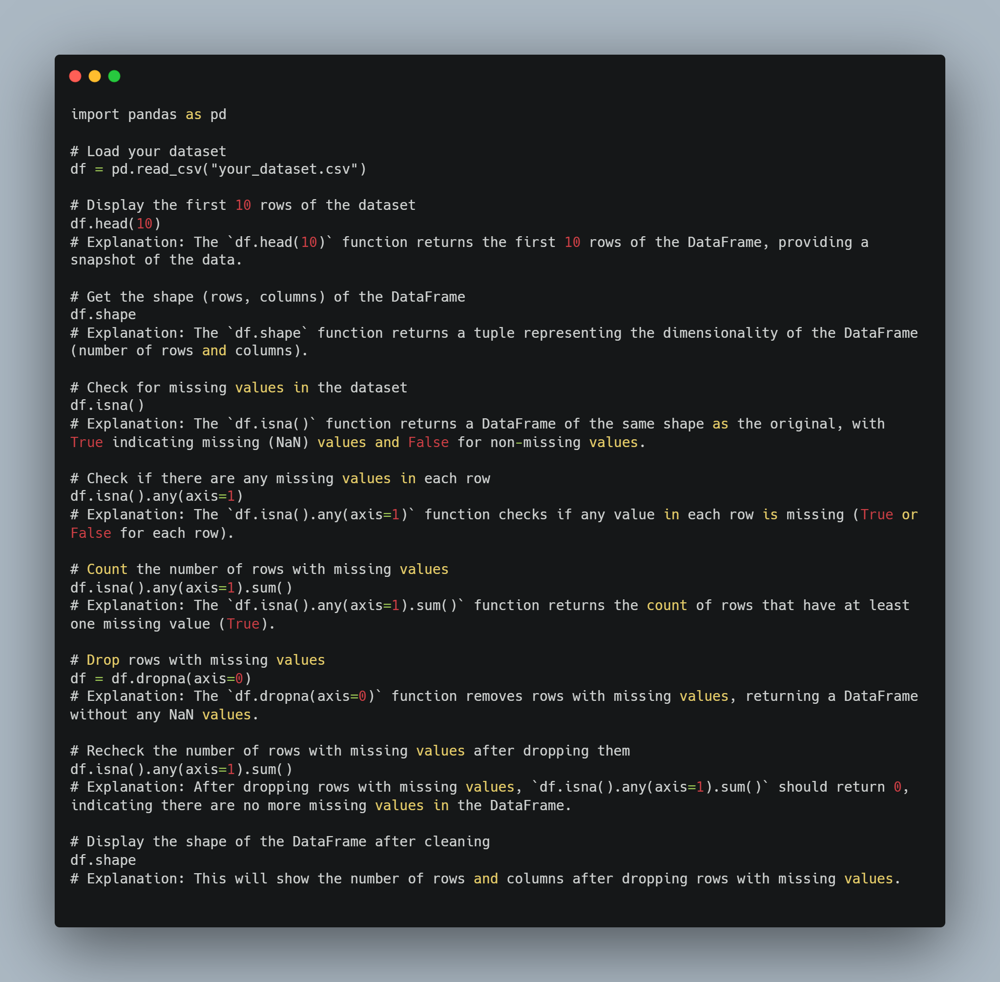
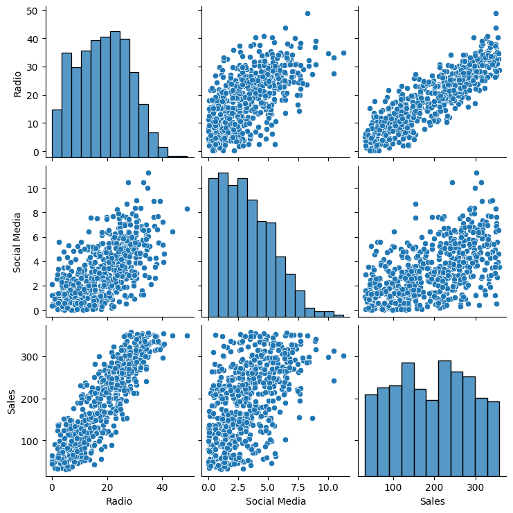
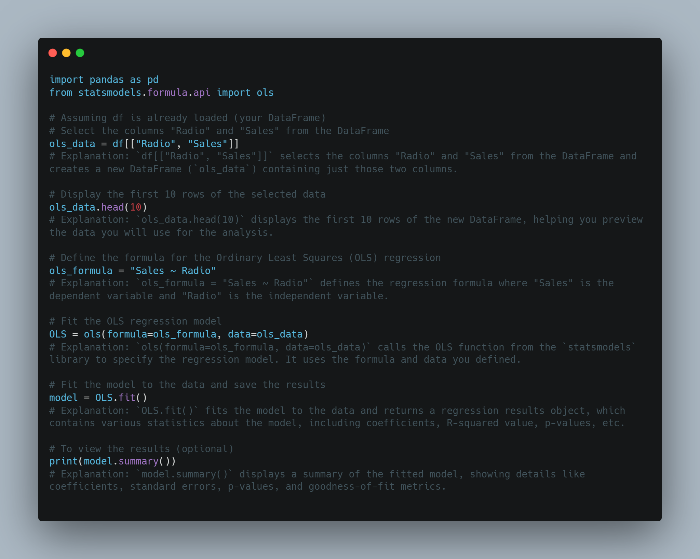
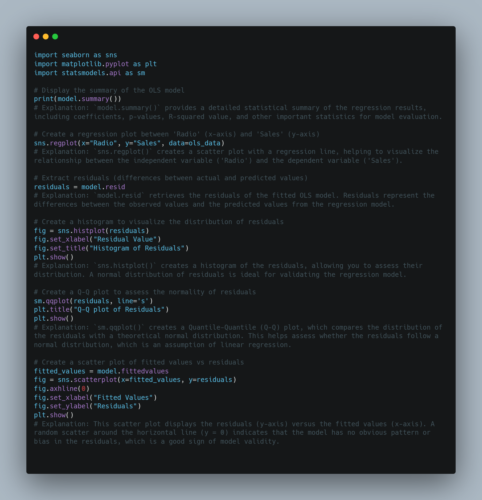
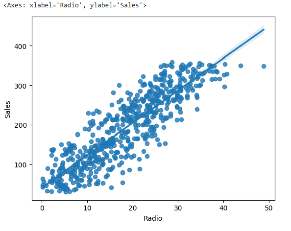
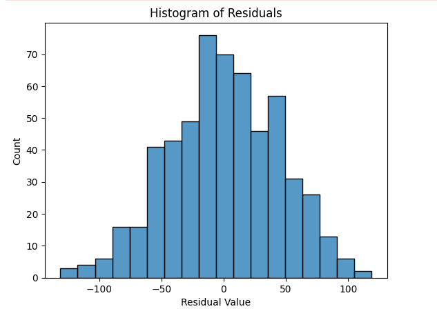
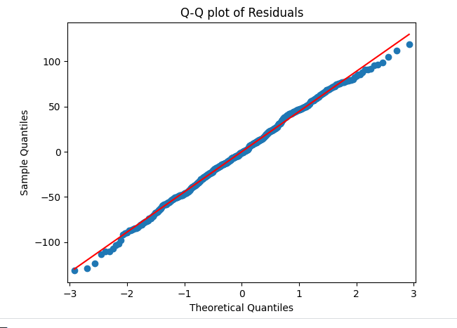
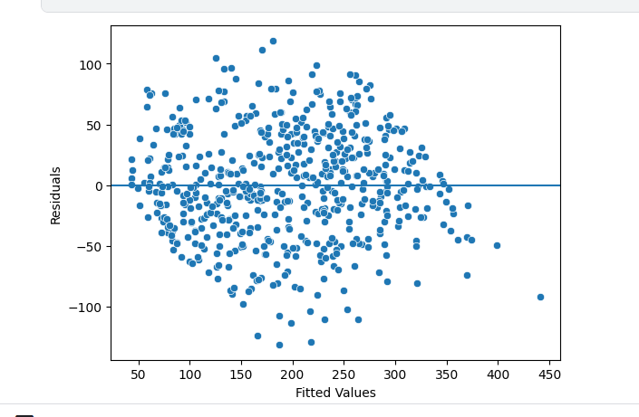

# Marketing Sales Analysis

 

## Introduction

Analyzing the Impact of Influencer Marketing with Simple Linear Regression

In this project, I worked as part of an analytics team tasked with delivering insights about our company's sales and marketing practices. My specific focus was on exploring the use of influencer marketing and analyzing its effectiveness in driving sales.

To achieve this, I employed simple linear regression to model the relationship between the radio promotion budget and sales revenue. This approach allowed me to assess both the direction and magnitude of the relationship between these variables, uncovering patterns that could guide data-driven decisions.

The dataset provided contained detailed information about various marketing campaigns, including investments in TV, radio, and social media promotions, as well as the corresponding revenue generated. By analyzing this data, I aimed to provide company leaders with actionable insights to optimize future marketing strategies.

The ultimate goal was to help decision-makers allocate resources more effectively by identifying which marketing channels deliver the highest return on investment. This project demonstrated the power of simple linear regression in transforming large datasets into meaningful insights, enabling better predictions and strategic decision-making. 

### Dataset Description 

This dataset contains information on sales performance and marketing expenditures across different advertising channels. It includes 572 observations and 5 variables, described as follows:

    TV (categorical: "Low", "Medium", "High"): Level of investment in TV advertising.
    Radio (numeric: float): Amount spent on radio advertising.
    Social Media (numeric: float): Amount spent on social media advertising.
    Influencer (categorical: "Mega", "Macro", "Micro"): Type of influencer used in the campaign.
    Sales (numeric: float): Total sales generated. 

##  Dataset Overview 

   Total Entries: 572
    Missing Values:
        TV: 1 missing value
        Radio: 1 missing value
        Sales: 1 missing value
    Descriptive Statistics:
        Radio: Mean ≈ 18.65, Min ≈ 0.19, Max ≈ 48.87
        Social Media: Mean ≈ 3.25, Min ≈ 0.01, Max ≈ 11.26
        Sales: Mean ≈ 193.52, Min ≈ 31.20, Max ≈ 358.42 

## Step 1: Imports and Data Loading  

- **1.1 Import Libraries**  
- **1.2 Load Dataset**

Before working with the dataset, we import necessary Python libraries such as pandas, numpy, seaborn, matplotlib, and statsmodels. 
The dataset is loaded into a Pandas DataFrame and reviewed for initial exploration.

 

## Step 2: Data Exploration  

In this step, we analyze the dataset to understand its structure, detect missing values, and examine relationships between variables. This helps in identifying patterns, potential issues, and key insights before further analysis.  

- **2.1 Display First 10 Rows** – Preview the first few rows to get an overview of the dataset.  
- **2.2 Dataset Dimensions** – Check the number of rows and columns to understand the dataset size.  
- **2.3 Check Missing Values** – Identify any missing data that may need to be handled.  
- **2.4 Handle Missing Values** – Apply strategies to deal with missing data (e.g., imputation or removal).  
- **2.5 Pairwise Relationships** – Explore relationships between variables using visualizations.  

 

I also use visualization techniques such as pairplots to explore relationships between features.

 

## Step 3: Model Building  

The process of creating, training, and validating mathematical or machine learning models to analyze data, make predictions, or solve specific problems. It involves selecting appropriate algorithms, preparing data, and tuning parameters to achieve optimal performance and accuracy.  

- **3.1 Select Relevant Columns** – Choosing the independent and dependent variables for the regression model.  
- **3.2 Linear Regression Formula** – Defining the regression equation to be fitted to the data.  
- **3.3 Fit the Model** – Training the linear regression model using `statsmodels`.

 

## Step 4: Results and Evaluation  

In this step, I evaluate the performance of my regression model by analyzing key metrics and visualizations. I check how well the model fits the data, identify potential issues, and ensure its reliability for making predictions. I examine the model summary, key coefficients, and various plots to assess residuals and validate assumptions like normality and homoscedasticity. This step helps me determine if my model is effective or needs further improvements before using it for decision-making. 🚀

- **4.1 Model Summary** – Generating a summary of the fitted model to interpret results.  
- **4.2 Key Coefficients** – Extracting and analyzing the key coefficients of the regression model.  
- **4.3 Regression Plot** – Visualizing the regression line and the relationship between variables.  
- **4.4 Residual Distribution** – Analyzing the distribution of residuals to check for normality.  
- **4.5 Q-Q Plot for Normality** – Using a Q-Q plot to further assess the normality of residuals.  
- **4.6 Scatterplot of Residuals** – Plotting residuals against predicted values to check for patterns or heteroscedasticity.

 

 

 

 

 

        

    

